# Akıllı Hava Kalitesi Ölçüm Cihazı Tasarımı - Ara Rapor

## 1. Proje Konusu
Bu proje hava kalitesini ölçmek ve kullanıcıyı zararlı durumlarda uyarmak
için tasarlanmış bir sistemdir. Gerekli sensörler kullanılarak veri toplanır
ve mikrodenetleyici yardımıyla işlenir. Veriler Wi-Fi üzerinden bir platforma aktarılır, böylece kullanıcılar gerçek zamanlı olarak sonuçlara erişebilir. Hava kalitesi kritik seviyelere ulaştığında sistem sesli uyarı ve bildirimler ile kullanıcıları anlık bilgilendirerek sağlık ve konfor için pratik bir çözüm sunar. 

## 2. Özet
Bu proje kapsamında, üç farklı sensör (DHT22, CCS811 ve PMS5003) kullanılarak hava kalitesini ölçme ve verileri kullanıcıya iletme işlemi gerçekleştirilmiştir. ESP32 mikrodenetleyicisi kullanılarak sensörlerden alınan veriler işlenmiş ve Blynk platformu üzerinden kullanıcıya sunulmuştur. Proje, IoT tabanlı bir sistem olup, kullanıcıların çevrelerindeki hava kalitesini izlemelerini sağlar.

## 3. Kullanılan Yöntemler
Proje, sensör verilerini toplamak ve işlemek için aşağıdaki yöntemleri kullanmaktadır:
- **DHT22**: Sıcaklık ve nem ölçümleri yapılır.
- **CCS811**: Karbondioksit (CO2) ve toplam uçucu organik bileşenler (TVOC) ölçülür.
- **PMS5003**: Partikül maddeler (PM1.0, PM2.5, PM10) ölçülür.
- **ESP32 Mikrodenetleyici**: Verileri toplar ve Wi-Fi aracılığıyla Blynk platformuna gönderir.
- **Blynk Platformu**: Verilerin mobil cihaz üzerinden görselleştirilmesini sağlar.

## 4. Yapılan Çalışmalar ve Görseller
### Yapılan Çalışmalar
- Her bir sensör (DHT22, CCS811, PMS5003) teker teker bağlanıp test edilmiştir.
- Sensörler, doğru şekilde veri alacak şekilde bir araya getirilmiştir.
- ESP32 ile sensörler birbirine bağlanmış ve Blynk platformuna veri gönderimi yapılmıştır.

### Görseller
Aşağıda kullanılan sensörlerin ve bağlantıların görselleri yer almaktadır:

### Görseller
| Sensör / Cihaz | Görsel | 
|----------------|--------|
| **DHT22 Sensörü** | 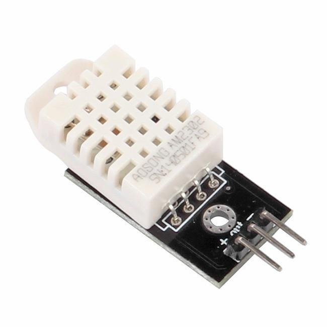 | 
| **CCS811 Sensörü** | 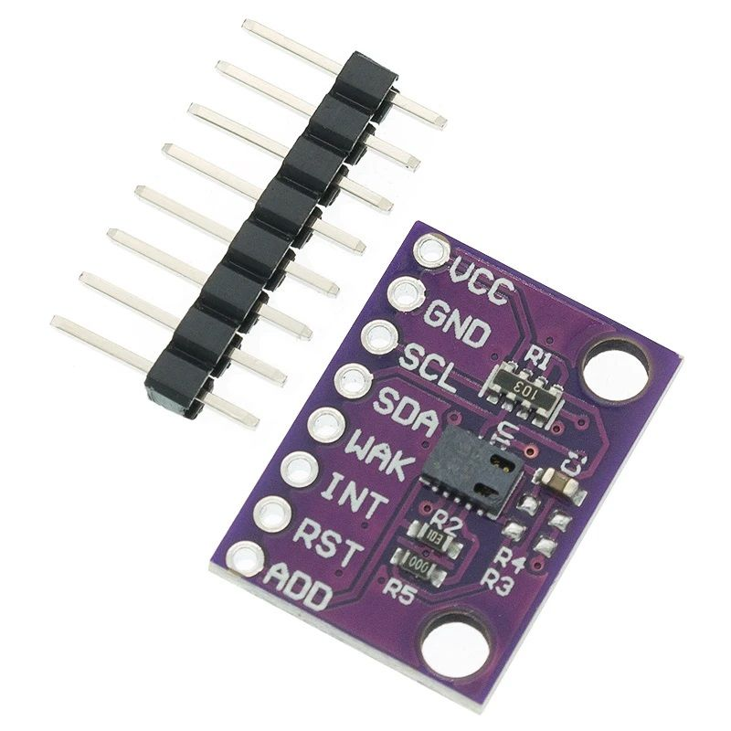 | 
| **PMS5003 Sensörü** | 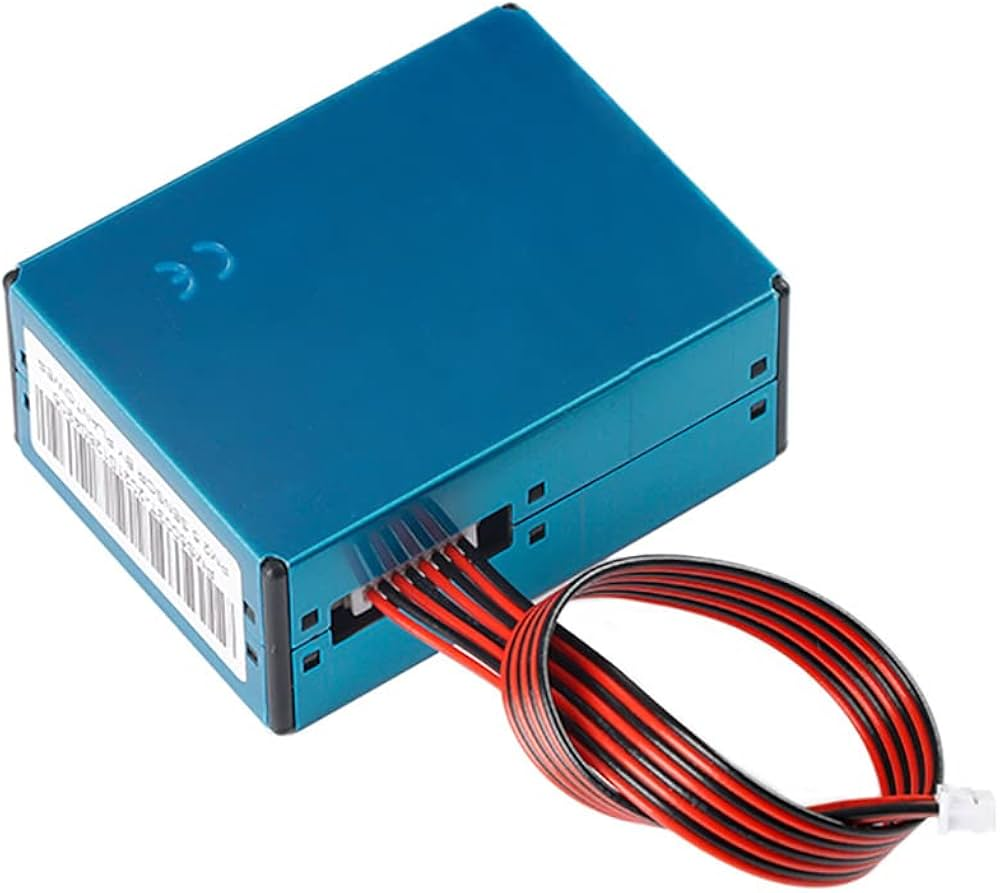 | 
| **ESP32 Mikrodenetleyici** | 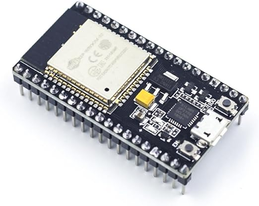 | 
| **Jumper Kabloları (Dişi-Erkek)** | 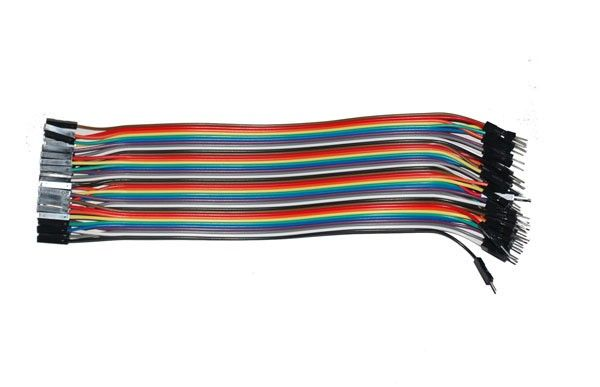 | 
| **Jumper Kabloları (Erkek-Erkek)** | 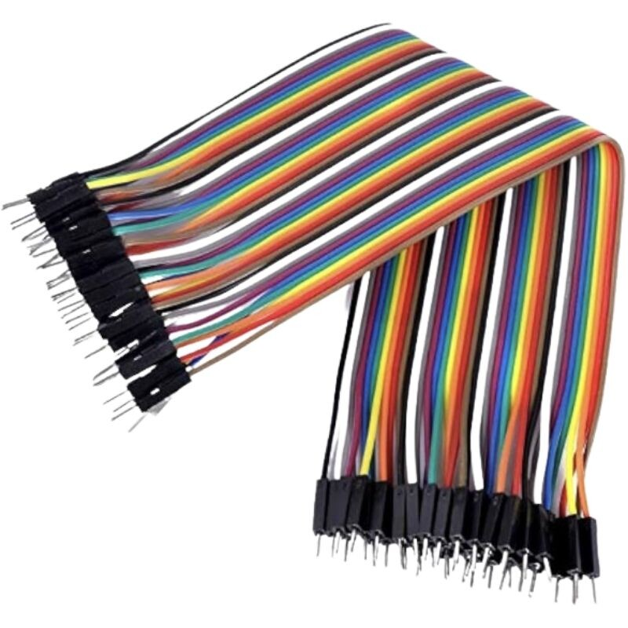 | 
| **BreadBoard** | 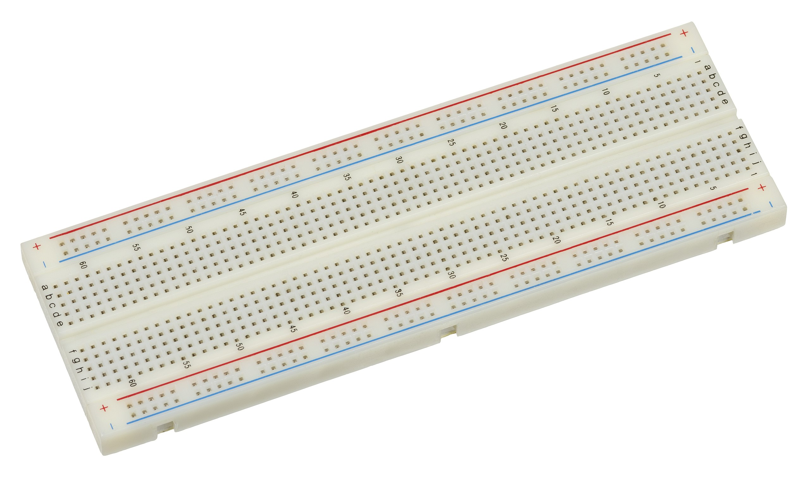 | 
| **Bağlantılar** | 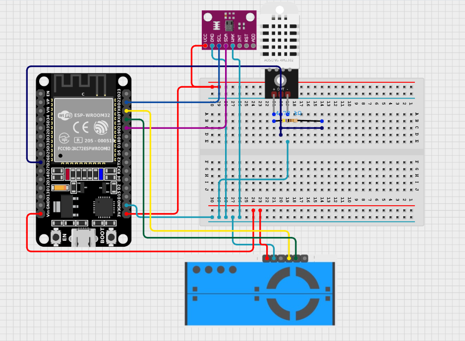 | 


## 5. Elde Edilen Sonuçlar

### Görseller
Aşağıda kullanılan Blynk Web/Mobil ve Serial Monitör üzerinden alınan sonuçlar paylaşılmıştır:

| **Blynk Mobil** | 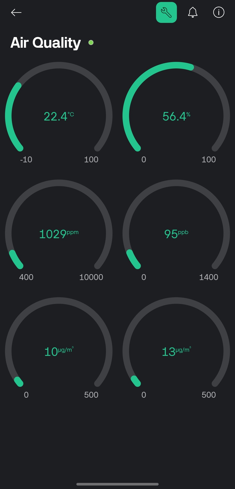 | 
| **Blynk Web** | 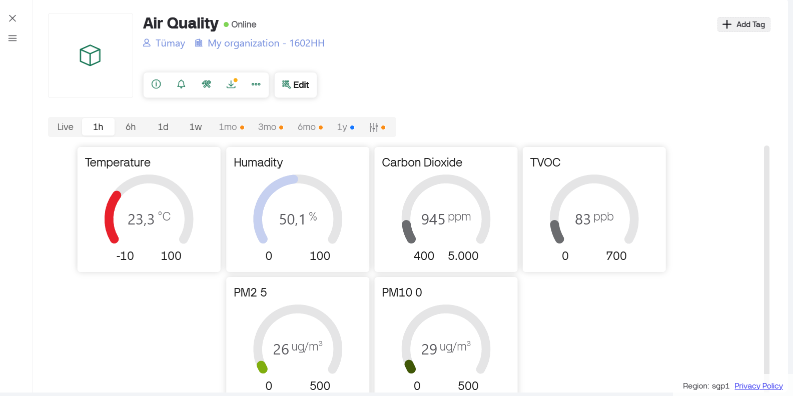 | 
| **Serial Monitör** | 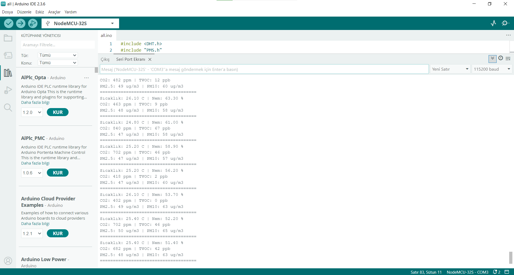 |


- **Sensörlerden alınan veriler doğru şekilde elde edilmiştir.**
  - Sıcaklık ve nem verileri DHT22'den doğru bir şekilde alınmıştır.
  - CO2 ve TVOC verileri CCS811 sensöründen başarıyla alınmıştır.
  - PM2.5 ve PM10 verileri PMS5003 sensöründen alınmıştır.
- **Blynk platformu üzerinden veriler izlenebilir hale getirilmiştir.**
  - Kullanıcı, mobil uygulama üzerinden sensör verilerini anlık olarak görüntüleyebilmektedir.

## 6. Karşılaşılan Sorunlar ve Çözümler
- **Sorun:** Sensörler birbirine bağlandığında, başlangıçta bazı sensörler doğru veri gönderememiştir.
  - **Çözüm:** Bağlantı noktaları yeniden kontrol edilerek doğru bağlantılar yapılmıştır. Ayrıca, sensörlerin besleme voltajları doğru şekilde sağlanmıştır.
  
- **Sorun:** Blynk platformunda 30000 veri sınırı bulunduğundan bir zaman sonra verileri görüntülemekte sorun yaşanmıştır.
  - **Çözüm:** Başka bir platforma geçmek hedeflenmiştir.(Thingspeak)

## 7. Projenin Devamında Yapılacaklar
- **Platform Değişikliği**: Thingspeak platformu kullanılarak verileri görüntülemek.
- **Veri analizi ve uyarı sisteminin eklenmesi**: Verilerin analiz edilmesi ve hava kalitesinin kötü olduğu durumlarda kullanıcıya sesli veya görsel uyarılar verilmesi sağlanacak.
- **Cihaz Tasarımı**: Bağlantıların lehimlenmesi ve cihazın kutulanması.

## 8. Ticari Değerlendirme
Maaliteyi düşürmek amacıyla CO2 Sensörü (MH-Z19B) projeden çıkarılmış ve CO2 hesaplaması CC811 üzerinden sağlanmaktadır. 

Bu proje, hava kalitesini takip etmek isteyen bireyler, kamu kurumları ve işletmeler için kullanılabilir. Potansiyel kullanım alanları:  
- Evler, ofisler ve okullar  
- Hastaneler
- Fabrikalar, üretim tesisleri ve atölyeler  
- Akıllı şehir projeleri ve çevre izleme sistemleri  

## 9. Dosya Yapısı
```
AraRapor/
│
├── AraRapor.md
└── Figure/
    ├── blynk_mobile.jpg
    ├── blynk_web.png
    ├── BreadBoard.jpg
    ├── CCS811.jpg
    ├── DHT22.jpg
    ├── ESP_WROOM_32.jpg
    ├── connections.png
    ├── Connections2.jpg
    ├── Jumper-fm.jpg
    ├── Jumper-mm.jpg
    ├── PMS5003.jpg
    └── serial_monitor.png

```