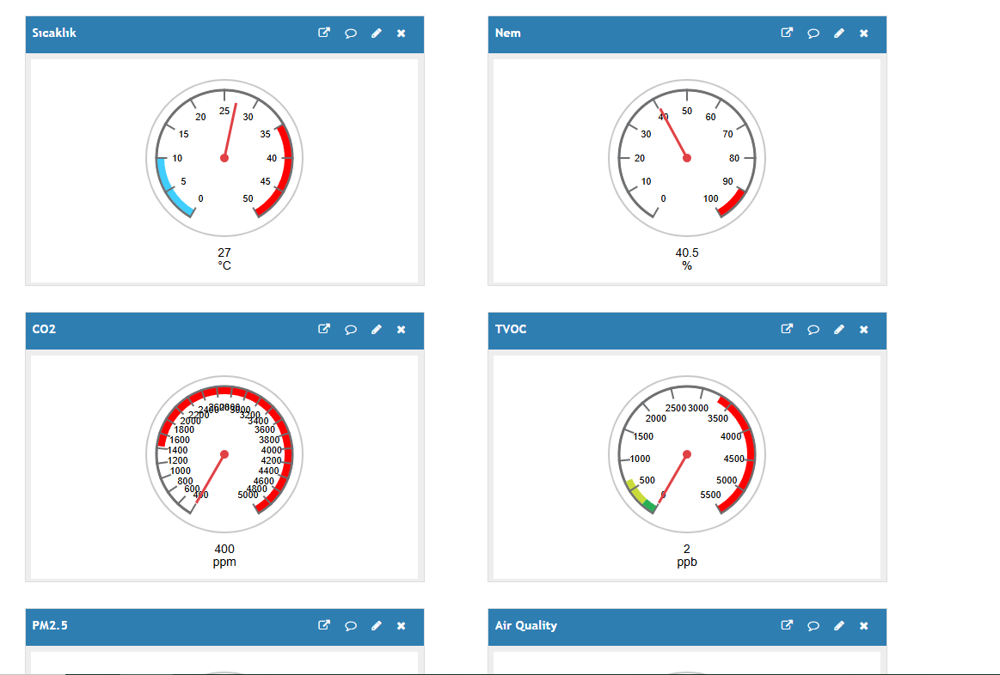
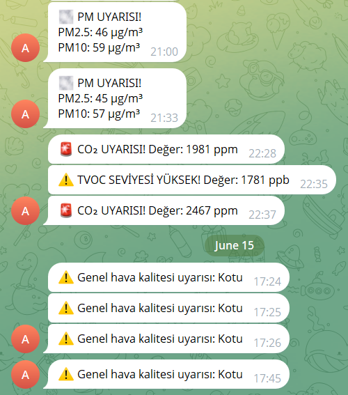
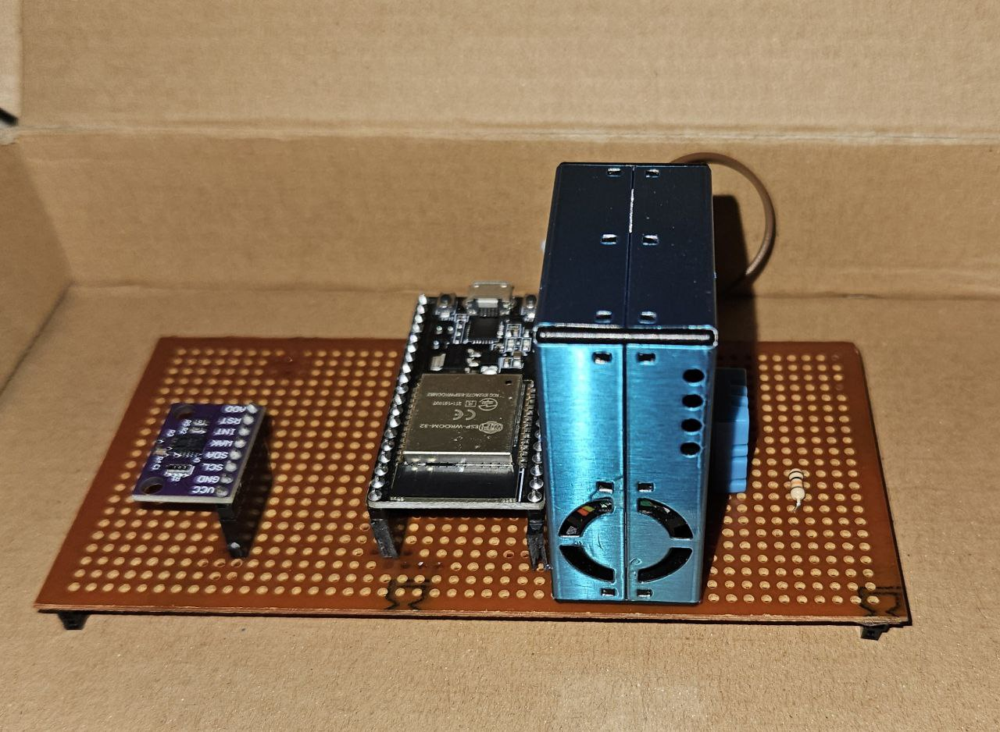

# Akıllı Hava Kalitesi Ölçüm Cihazı Tasarımı – Final Raporu

## 1. Proje Konusu
Bu proje hava kalitesini ölçmek ve kullanıcıyı zararlı durumlarda uyarmak
için tasarlanmış bir sistemdir. Gerekli sensörler kullanılarak veri toplanır
ve mikrodenetleyici yardımıyla işlenir. Veriler Wi-Fi üzerinden bir platforma aktarılır, böylece kullanıcılar gerçek zamanlı olarak sonuçlara erişebilir. Hava kalitesi kritik seviyelere ulaştığında sistem sesli uyarı ve bildirimler ile kullanıcıları anlık bilgilendirerek sağlık ve konfor için pratik bir çözüm sunar. 

## 2. Özet
Bu proje kapsamında, üç farklı sensör (DHT11, CCS811 ve PMS5003) kullanılarak hava kalitesini ölçme ve verileri kullanıcıya iletme işlemi gerçekleştirilmiştir. ESP32 mikrodenetleyicisi kullanılarak sensörlerden alınan veriler işlenmiş ve Blynk platformu üzerinden kullanıcıya sunulmuştur. Proje, IoT tabanlı bir sistem olup, kullanıcıların çevrelerindeki hava kalitesini izlemelerini sağlar.

## 3. Kullanılan Yöntemler
- **Sensör Kullanımı:**
  - DHT11: Sıcaklık ve nem ölçümü.
  - CCS811: eCO₂ ve TVOC ölçümü.
  - PMS5003: PM2.5 ölçümü.
- **Veri Toplama:** ESP32 ile 15 saniyede bir veri toplanmakta ve işlenmektedir.
- **Veri Aktarımı:** HTTP protokolü üzerinden ThingSpeak API'ye veri gönderimi yapılmaktadır.
- **Uyarı Sistemi:** Telegram Bot API ile hava kalitesi kötüleştiğinde bildirim gönderilmektedir.
- **Kalibrasyon:** CCS811 sensörü için baseline değeri EEPROM ile saklanmaktadır.
- **Puanlama:** Isı indeksi ve ortalama değerler ile hava kalitesi derecelendirilmiştir.

## 4. Yapılan Çalışmalar ve Görselleri
- Sensörler ayrı ayrı test edilmiş ve çalıştıkları doğrulanmıştır.
- Tüm sensörler aynı anda ESP32’ye bağlanarak birlikte veri akışı test edilmiştir.
- ThingSpeak platformuna veri gönderimi ve görüntülenmesi başarıyla gerçekleştirilmiştir.
- Telegram bot ile uyarı sistemi kurulmuş ve çalışır hale getirilmiştir.
- CCS811 için EEPROM destekli baseline yönetimi kodlanmıştır.
- Her sensör için eşik değerler belirlenmiş ve değerlendirme algoritmaları uygulanmıştır.

### Görseller

**ThingSpeak Arayüzü**  

**Telegram Uyarısı**  

**Cihaz Bağlantısı**  

## 5. Elde Edilen Sonuçlar
- Tüm sensörler tutarlı ve güncel veri üretmektedir.
- ThingSpeak platformunda tüm ölçüm parametreleri düzenli olarak izlenebilmektedir.
- Kullanıcıya Telegram üzerinden doğru ve zamanında uyarılar ulaştırılmaktadır.
- Isı indeksi ve hava kalitesi skoru başarıyla hesaplanmıştır.
- Sistem düşük güç tüketimiyle(5V,120mA) taşınabilirlik açısından uygundur.

## 6. Karşılaşılan Sorunlar ve Çözümler
- **DHT22 güç sorunu:** DHT22 cihazı bütün cihazlar bir arada çalışırken bazen akım yetmeediği için DHT11 e geçiş yapıldı.
- **CCS811 sabit değer üretmesi:** EEPROM ile baseline değeri yönetimi eklendi ve çevresel kalibrasyon yapıldı.
- **Wi-Fi kopmaları:** Kod içerisine otomatik bağlantı yenileme mekanizması entegre edildi.
- **ThingSpeak veri limiti:** Blynk platformu ile veri sınırı aşılıyordu. Thingspeak ile bu sorun çözüldü. 
- **Telegram mesajlarının sık tekrarı:** Uyarılar için zaman kontrolü kod içerisine dahil edildi (örneğin dakikada bir mesaj sınırlaması).

